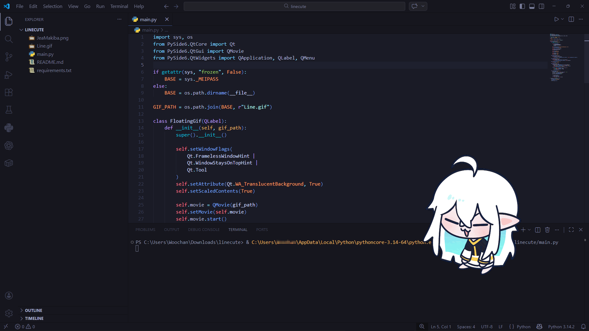

# linecute

바탕화면에서 귀여운 라인이를 보실 수 있습니다!!!!!!!

# 기능

- 마우스로 이동 시킬 수 있어요!!
- 마우스 휠로 크기를 조절할 수 있어요!!
- Ctrl + 마우스 휠로 투명도도 조정 가능해요!!
- 우클릭을 눌러서 잠금 / 종료를 할 수 잇어요!!!

# 사용법

- 먼저 파이썬을 다운해야해요!! [여기서](https://www.python.org/downloads/) 다운 가능해요!!
- 설치 시에는 반드시, **Add Python to PATH** 옵션을 체크해야 해요!!
- 설치 후엔 설치가 잘 됐는지 확인하기 위해서, cmd에 들어가 `python --version`을 하셔서 체크해보세요!!
- 설치가 완료 되었다면, `git clone https://github.com/sanssanssanssanssanssans/linecute`를 하시거나, ZIP 파일로 다운로드 하셔서 압축을 풀어주세요!!
- 그 다음, cmd에 들어가 `pip install -r requirements.txt`를 써서 라이브러리를 설치하세요!!
- 마지막으로 `python main.py`로 실행하면 끝!!

# 라이선스

MIT!!